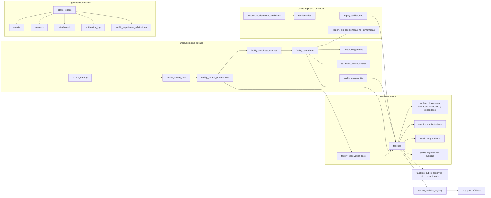
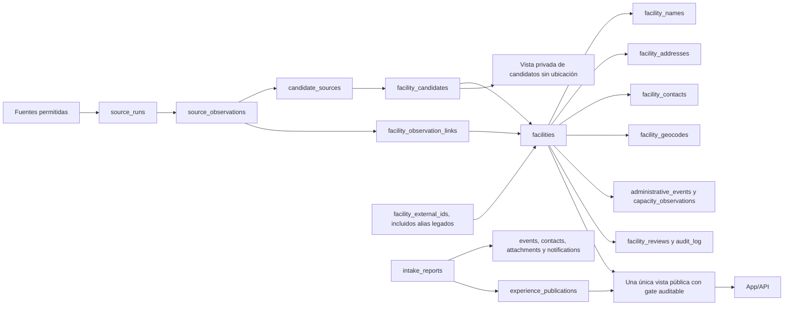

# Auditoría integral de simplificación de Supabase — 11 de agosto de 2026

## 1. Conclusión ejecutiva

La base no está sobrediseñada por tener muchas tablas. La mayor parte de la
separación de `elepem_core` y `discovery_private` está justificada por
cardinalidad, historial, procedencia, moderación y seguridad. Unificar nombres,
direcciones, contactos, geocódigos, fuentes y revisiones dentro de una sola
tabla produciría columnas repetidas o JSONB difícil de validar y haría más débil
la trazabilidad legal del sistema.

La complejidad evitable está en las capas transitorias y en contratos que se
solapan:

1. `public.elepem_sin_coordenadas_no_confirmadas` es una copia materializada de
   71 filas de `discovery_private.facility_candidates`. No tiene consumidor en
   el repositorio, carece de claves foráneas y expone la cola a cualquier rol
   `authenticated`. Debe reemplazarse por una vista privada o consulta interna.
2. `public.residenciales` ya está completamente mapeada al núcleo: 801 de 801
   filas tienen una correspondencia exacta y única. El runtime web usa el padrón
   normalizado, pero varios scripts todavía leen o escriben la tabla antigua.
3. `public.residencial_discovery_candidates` pertenece al flujo anterior. Sus
   40 filas no pueden borrarse sin reconciliación: 17 fueron promovidas y 23
   siguen pendientes; solo 11 tienen una coincidencia única con la cola nueva
   por nombre, departamento y dirección normalizados.
4. `elepem_core.legacy_facility_map` sigue siendo necesaria para resolver IDs
   antiguos, pero sus 801 filas están todas `mapped`, con `exact_id`, confianza
   1 y cardinalidad uno-a-uno. Después de retirar el padrón legado puede
   consolidarse en `facility_external_ids` como alias legado, conservando la
   evidencia de la migración en auditoría.
5. Existen dos contratos de publicación incompatibles: el runtime usa
   `arandu_facilities_registry` con 1.020 filas, mientras
   `facilities_public_approved` tiene 0. De las filas visibles, 983 conservan
   `review_status = needs_review` y 703 no tienen marca MSP/MIDES. La apertura
   fue registrada como una autorización masiva explícita del operador, no como
   publicación automática, pero `publication_status` y `facility_reviews` no
   son actualmente la puerta del mapa público. Antes de consolidar las vistas
   se debe decidir y documentar una única regla de publicación.
6. Hay drift de despliegue importante: tres tablas de WhatsApp y una función de
   límite de adjuntos existen en migraciones y tienen consumidores activos, pero
   no existen en la instancia. A la inversa, el archivo local que creó
   `intake_reports` ya no está en el repositorio. El ledger de Supabase termina
   el 2 de agosto aunque la instancia contiene objetos agregados después.

La reducción conservadora posible es de **33 a 29 tablas** en tres etapas, sin
fusionar el núcleo normalizado:

| Etapa | Tablas | Cambio |
|---|---:|---|
| Actual | 33 | 8 `public`, 7 `discovery_private`, 17 `elepem_core`, 1 `arandu_demo` |
| 1 | 32 | Reemplazar `elepem_sin_coordenadas_no_confirmadas` por una vista/consulta privada |
| 2 | 30 | Reconciliar y retirar los dos flujos legados: `residenciales` y `residencial_discovery_candidates` |
| 3 | 29 | Absorber los alias resueltos de `legacy_facility_map` en `facility_external_ids` |

`facility_social_accounts`, hoy vacía, podría llevar el total a 28, pero no se
recomienda retirarla todavía: representa una política de retención diferente a
la de contactos y observaciones, y debe decidirse junto con el flujo permitido
de URLs sociales públicas.

## 2. Alcance, evidencia y método

La auditoría se ejecutó el 11 de agosto de 2026 contra PostgreSQL 17.6. Todas
las consultas se realizaron dentro de `BEGIN TRANSACTION READ ONLY`, con
`statement_timeout` y `lock_timeout`, y finalizaron con `ROLLBACK`. No se
consultaron ni copiaron filas nominales: únicamente catálogo, definiciones y
agregados.

Fuentes locales verificadas:

| Archivo | SHA-256 |
|---|---|
| `Referencias.md` | `071670AAC48457EF9B65577B9664425B1F51AA895736B107396820C86A40C2C8` |
| `Arriba.png` | `FE6A3C4E08EEA7B78195FA1239739E35B30175DDB9DB2F72F4C244E7D78A7943` |
| `Abajo.png` | `8C4CC51887DF07C6BB4794F85D1E90A771757F850F4B4AD533A861053F0C10EE` |

También se contrastaron `supabase/migrations`, `supabase/rollbacks`, las
funciones Edge, los accesos SQL de `app/`, `lib/` y `scripts/`, el catálogo vivo
de PostgreSQL, las políticas RLS y los grants de `anon`, `authenticated` y
`service_role`.

No se inspeccionó el contenido del bucket de adjuntos ni se hizo una prueba
funcional de proveedores externos. Tampoco se alteró `Base de Datos/`.

## 3. Reconciliación del inventario

### 3.1. Resumen del catálogo vivo

| Esquema | Tablas | Filas exactas | Tamaño total | Función principal |
|---|---:|---:|---:|---|
| `public` | 8 | 933 | 1.640 kB | Intake, legado y proyecciones |
| `discovery_private` | 7 | 4.723 | 5.312 kB | Descubrimiento y revisión privada |
| `elepem_core` | 17 | 11.048 | 8.712 kB | Registro normalizado y auditable |
| `arandu_demo` | 1 | 0 | 32 kB | Capa ficticia controlada por `DEMO_MODE` |
| **Total** | **33** | **16.704** | **15.696 kB** | |

Además hay 8 vistas, 10 funciones en los esquemas analizados y 14 triggers de
aplicación. Las 32 tablas del snapshot existen en la instancia y sus nombres de
columnas coinciden; el snapshot no contiene vistas ni la tabla demo.

### 3.2. Diferencias entre snapshot, repositorio e instancia

| Diferencia | Evidencia | Consecuencia |
|---|---|---|
| Tabla viva no mostrada | `arandu_demo.facilities` | Esperable: capa demo aislada y actualmente vacía |
| Objetos vivos no mostrados | 8 vistas | Las capturas no alcanzan para entender el contrato de lectura |
| Declarado en migraciones, ausente en vivo | `intake_channel_links`, `intake_ingestion_requests`, `alerta_mayor_whatsapp_sandbox_memory` | Las rutas n8n fallarán cuando intenten consultar o escribir estas tablas |
| Función/trigger ausente en vivo | `app_private.enforce_intake_attachment_limit` | El límite de adjuntos depende solo de controles de aplicación y queda expuesto a carreras |
| Aplicado pero sin archivo local de creación | `public.intake_reports` | Una base nueva no se puede reproducir solo con el árbol actual de migraciones |
| Ledger incompleto | Solo 8 versiones registradas; termina en `20260802053401` | Los objetos posteriores se aplicaron fuera del mecanismo normal de migraciones |

La existencia de migraciones posteriores en disco no demuestra que hayan sido
aplicadas. Antes de cualquier simplificación se debe corregir esta fuente de
verdad de despliegue; de lo contrario, una migración de limpieza podría partir
de un estado equivocado.

## 4. Arquitectura y flujo actual

La aplicación web fuerza `runtimeElepemDataSource()` a `normalized`; por tanto,
la lectura pública activa es `public.arandu_facilities_registry`. Las ramas
`legacy` y `compatibility` permanecen para scripts, auditoría y código de
transición, no para el runtime público normal.

## 5. Inventario y decisión por tabla

### 5.1. `public`

| Tabla | Filas / columnas | Consumidores y función | Decisión | Fundamento |
|---|---:|---|---|---|
| `intake_reports` | 6 / 15 | APIs de ingreso, seguimiento, equipos, instituciones y triggers | **Mantener** | Raíz transaccional; mezcla controlada de payload privado y estado |
| `intake_report_events` | 14 / 9 | Timeline de estado; append-only | **Mantener** | Relación uno-a-muchos y retención distinta del reporte |
| `intake_report_attachments` | 0 / 10 | Edge Function y APIs de evidencia | **Mantener** | Metadatos de Storage, límites y ciclo de borrado propios |
| `intake_notification_log` | 0 / 5 | Edge Function de notificación | **Mantener** | Idempotencia por reporte/tipo; no es un evento editorial |
| `intake_report_contacts` | 1 / 6 | Intake e inbox estatal | **Mantener** | Datos personales con superficie de acceso más restringida |
| `residenciales` | 801 / 21 | Scripts legados; no es la fuente web activa | **Deprecar** | 801/801 mapeadas uno-a-uno al núcleo; 800 están en el registro actual y coinciden en identidad/localización |
| `residencial_discovery_candidates` | 40 / 29 | CLI antiguo de descubrimiento/revisión/promoción | **Consolidar** | Reconciliar en la cola privada nueva y congelar escritores antes de retirar |
| `elepem_sin_coordenadas_no_confirmadas` | 71 / 24 | Sin consumidor encontrado | **Reemplazar por vista** | Copia exacta de candidatos, sin FK/checks, con JSON duplicado y exposición `authenticated` |

En el contraste legado/canónico, 800 filas visibles coinciden en nombre,
departamento, localidad, dirección y coordenadas. Hay dos diferencias de
capacidad y una sede mapeada que no entra al registro actual; ambas situaciones
deben resolverse antes de retirar `residenciales`.

### 5.2. `discovery_private`

| Tabla | Filas / columnas | Consumidores y función | Decisión | Fundamento |
|---|---:|---|---|---|
| `facility_source_runs` | 72 / 13 | Importadores y trazabilidad por ejecución | **Mantener** | Una ejecución agrupa muchas observaciones y conserva hash/estado |
| `facility_source_observations` | 2.690 / 21 | Importadores, matching, vistas de fuentes | **Mantener** | Evidencia inmutable; es la pieza central de procedencia |
| `facility_candidates` | 229 / 22 | API de revisión, importadores y geocodificación | **Mantener** | La pista no debe confundirse con una sede canónica |
| `facility_candidate_sources` | 493 / 7 | Evidencia A/B/C y controles de independencia | **Mantener** | Unión muchos-a-muchos con semántica propia |
| `facility_external_ids` | 838 / 12 | Importadores y deduplicación | **Mantener y ampliar** | La unicidad proveedor/ID es una clave fuerte; puede recibir los alias legados |
| `facility_candidate_match_suggestions` | 90 / 9 | API de equipo y sincronizador de matching | **Mantener** | Son sugerencias regenerables, no decisiones humanas |
| `facility_candidate_review_events` | 311 / 15 | API de revisión; append-only | **Mantener** | Historial de decisión separado del estado actual del candidato |

Las 229 candidatas tienen fuente y `resolved_facility_id`. Esto no vuelve
redundante la tabla: varias siguen `needs_review` o `possible_match`, y el vínculo
con una sede conserva la historia del descubrimiento sin convertir la pista en
el registro canónico.

`facility_external_ids.residencial_id` está nulo en sus 838 filas. Los 808 IDs
`official` apuntan a sedes y los 30 `openstreetmap` a candidatos; todos conservan
observación. La tabla admite consolidar alias legados, pero no debe absorber las
observaciones ni la cola de candidatos.

### 5.3. `elepem_core`

| Tabla | Filas / columnas | Multiplicidad/uso | Decisión | Fundamento |
|---|---:|---|---|---|
| `facilities` | 1.122 / 23 | Entidad raíz de sede física | **Mantener** | Fuente canónica de identidad y visibilidad |
| `source_catalog` | 52 / 12 | Catálogo compartido por runs/observaciones | **Mantener** | Evita repetir proveedor, canal, licencia y retención |
| `organizations` | 28 / 7 | Operadores legales | **Mantener** | Una organización puede administrar varias sedes |
| `facility_operators` | 33 / 8 | 33 sedes, rol vigente | **Mantener** | Relación temporal muchos-a-muchos; no pertenece a `facilities` |
| `facility_names` | 1.198 / 10 | 1.122 sedes; hasta 3 nombres | **Mantener** | Alias e historia; 75 sedes ya tienen más de un nombre |
| `facility_addresses` | 1.292 / 13 | 1.096 sedes; hasta 2 direcciones | **Mantener** | Domicilios actuales e históricos, con observación propia |
| `facility_contacts` | 537 / 10 | 325 sedes; hasta 3 contactos | **Mantener** | Cardinalidad y tipos múltiples; no concatenar en una celda |
| `facility_social_accounts` | 0 / 9 | Sin escritor/lector encontrado | **Requiere evidencia adicional** | Mantener solo si habrá selección canónica de URL, fecha y nota humana |
| `facility_observation_links` | 2.688 / 6 | 1.121 sedes; hasta 6 observaciones | **Mantener** | Evidencia muchos-a-muchos y nivel de independencia |
| `facility_administrative_events` | 1.495 / 11 | 869 sedes; hasta 4 hechos | **Mantener** | MSP, MIDES y PACP no pueden reducirse a un booleano único |
| `facility_capacity_observations` | 324 / 8 | Una observación por 324 sedes | **Mantener** | Aunque hoy es 1:1, tiene fecha y procedencia histórica |
| `facility_geocodes` | 1.049 / 18 | 1.039 sedes; hasta 2 ubicaciones | **Mantener** | Fuente, precisión, revisión y respuesta permitida son independientes |
| `facility_reviews` | 49 / 8 | Append-only; una por 49 sedes hoy | **Mantener** | Debe admitir decisiones sucesivas sin sobrescribir historia |
| `audit_log` | 378 / 9 | Registro append-only | **Mantener** | No es equivalente a una revisión de negocio |
| `legacy_facility_map` | 801 / 9 | Todas exactas, únicas y resueltas | **Consolidar** | Migrar alias a `facility_external_ids` una vez retirados los consumidores legados |
| `facility_experience_publications` | 1 / 14 | Workflow activo de preview/publicación/retiro | **Mantener** | Estado moderado diferente al reporte original |
| `facility_public_profiles` | 1 / 11 | Perfil editorial público | **Mantener** | Separación 1:1 intencional por exposición y edición institucional |

Hay 1.122 nombres preferidos, pero solo 1.078 direcciones físicas actuales,
1.021 geocódigos actuales, 324 capacidades y 33 operadores. Convertir estas
relaciones en columnas de `facilities` no elimina la necesidad de representar
ausencia, historia y procedencia; únicamente traslada la complejidad a nulos y
triggers.

### 5.4. `arandu_demo`

| Tabla | Filas / columnas | Decisión | Fundamento |
|---|---:|---|---|
| `facilities` | 0 / 19 | **Mantener mientras exista `DEMO_MODE`** | Está aislada, sin grants API, y el código solo la consulta cuando el modo demo está activo |

Si `DEMO_MODE` se retira del producto, esta tabla y el esquema completo pueden
deprecarse juntos. Su tamaño actual no agrega complejidad operativa relevante.

## 6. Vistas, funciones, triggers e índices

### 6.1. Vistas

| Vista | Filas actuales | Uso | Decisión |
|---|---:|---|---|
| `arandu_facilities_registry` | 1.020 | Fuente activa de app/API pública | **Consolidar** con una única regla de publicación |
| `facilities_public_approved` | 0 | Sin consumidor activo | **Consolidar**, no borrar antes de resolver el gate |
| `facilities_current_internal` | 1.122 | Matching y revisión privada | **Mantener** |
| `known_facilities_exclusion_view` | 1.350 | Exclusión y deduplicación | **Mantener** |
| `arandu_facility_source_links` | 2.274 | Fuentes del registro público | **Mantener** |
| `arandu_facilities_identity_queue` | 84 | Sin consumidor de código encontrado | **Requiere evidencia adicional** sobre uso manual en Supabase |
| `residenciales_legacy_compat` | 801 | Rama de compatibilidad no activa | **Deprecar** con `residenciales`; hoy solo hace `SELECT` de la tabla legada |
| `facility_experiences_published` | 1 | Lectura moderada con grant a `service_role` | **Mantener** |

La vista pública objetivo debe ser una sola. La recomendación conservadora es
usar una condición explícita y auditable de publicación, no inferirla de tener
coordenadas. Cambiar inmediatamente a `publication_status = approved` ocultaría
las 1.020 filas actuales, por lo que primero se necesita una decisión humana y
un backfill trazable de autorizaciones.

### 6.2. Funciones y triggers

Las funciones vivas de aplicación son:

- `app_private`: `record_intake_received`, `keep_intake_events_append_only`.
- `discovery_private`: guard de elegibilidad pública y rechazo de mutaciones de
  eventos de revisión.
- `elepem_core`: actualización de timestamps, publicación, snapshot oficial,
  append-only y validación de experiencias.
- `public.rls_auto_enable`: función administrada por la plataforma.

Los 14 triggers vivos protegen append-only, visibilidad, snapshots MSP/MIDES,
timestamps e integración de intake. No se recomienda consolidarlos en una sola
función genérica: las reglas de negocio y las tablas afectadas son diferentes.

Falta en vivo `app_private.enforce_intake_attachment_limit` y su trigger. Debe
resolverse junto con la migración WhatsApp ausente, no recrearse de forma
aislada.

### 6.3. Integridad e índices

- Hay 33 claves primarias, 52 claves foráneas, 22 restricciones `UNIQUE` y 251
  checks; todas figuran validadas.
- No se detectó drift de columnas entre las 32 tablas del snapshot y la
  instancia.
- Siete FKs no tienen un índice cuyo prefijo sea la columna referenciante:
  `observation_id` en nombres, direcciones, contactos, operadores y redes
  sociales, y los dos IDs sugerido/promovido del flujo de descubrimiento legado.
  No justifican fusionar tablas; deben evaluarse como mejora de rendimiento o
  desaparecer con las tablas legadas.
- `elepem_sin_coordenadas_no_confirmadas` es la excepción de integridad: tiene
  cero FKs y cero checks pese a duplicar IDs, estados, coordenadas, revisión y
  fuentes. Sus 71 `candidate_id` existen, sus claves coinciden y sus valores
  actuales no difieren del origen, pero nada evita que diverjan después.

## 7. Calidad, trazabilidad y exposición

### 7.1. Procedencia

- Hay 2.690 observaciones, de las cuales 2.687 están enlazadas a una sede y 493
  a un candidato. Solo 2 observaciones OSM no están vinculadas a ninguna de las
  dos entidades.
- 1.121 de 1.122 sedes tienen al menos una observación vinculada.
- Las 229 candidatas tienen fuentes.
- Dos `source_runs` tienen contadores desactualizados: un run `other` registra
  154 observaciones frente a 174 reales y uno `public_directory` registra 154
  frente a 164. El resto coincide.
- `raw_metadata` está nulo en las 2.690 observaciones. No es motivo suficiente
  para borrar la columna sin decidir si se usará para payload permitido; sí es
  una señal de que no debe agregarse más JSONB preventivo.

### 7.2. RLS y grants

- Las 33 tablas tienen RLS habilitado.
- Las 17 tablas de `elepem_core` y las 7 de `discovery_private` usan RLS forzado,
  sin grants para `anon` o `authenticated`; `service_role` recibe solo permisos
  explícitos sobre el subconjunto operativo.
- `intake_reports` permite únicamente `INSERT` anónimo/autenticado con check de
  fuente y prioridad. Eventos, adjuntos, contactos y notificaciones niegan
  acceso directo y conceden acceso al servicio.
- Las vistas públicas no tienen `SELECT` para `anon` o `authenticated`; la app
  las consulta desde el servidor y decide qué expone por sus rutas.
- `elepem_sin_coordenadas_no_confirmadas` concede privilegios amplios de tabla
  a roles API y una policy `SELECT` para cualquier `authenticated`. Aunque RLS
  bloquea las demás operaciones, la lectura revela nombres, direcciones, notas
  de revisión, identidad de revisión y fuentes de una cola que debería ser
  privada. Es el hallazgo de seguridad más directo de esta auditoría.
- La conexión PostgreSQL del servidor usa un rol administrativo con capacidad
  de omitir RLS. Esto facilita workflows internos, pero convierte cada consulta
  del servidor en frontera de autorización. Se recomienda separar un rol de
  lectura pública y roles internos de escritura con privilegio mínimo.

### 7.3. Publicación

`arandu_facilities_registry` muestra 1.020 sedes:

- 983 con `review_status = needs_review` y 37 verificadas;
- 212 con marca MSP final;
- 275 con certificado social MIDES;
- 703 sin ninguna de esas dos marcas;
- 52 sin enlaces de fuente en la proyección;
- 1 demo.

En `facilities`, 1.120 filas tienen `publication_status = private`, una
`eligible` y una `withdrawn`; ninguna está `approved`. La vista
`facilities_public_approved` devuelve cero filas. El registro público actual se
apoya en `registry_visibility = public` y en una autorización masiva del
operador registrada en `audit_log`, no en el workflow de `facility_reviews`.

Esto no prueba publicación automática, porque existe una instrucción explícita
documentada. Sí prueba que hay dos modelos de autorización que pueden producir
resultados opuestos. No deben coexistir indefinidamente.

## 8. Modelo simplificado recomendado

Cambios conceptuales del objetivo:

1. No conservar una tabla derivada para candidatos sin ubicación; calcular la
   lista desde `facility_candidates`, `candidate_sources` y observaciones.
2. Congelar y reconciliar `residencial_discovery_candidates`; importar a la
   cola privada únicamente lo que deba seguir activo y archivar el resto con
   trazabilidad.
3. Sustituir lectores/escritores de `residenciales` por el núcleo y sus vistas.
   Durante la transición puede reescribirse la vista de compatibilidad desde el
   núcleo; no debe seguir siendo un alias de la tabla vieja.
4. Registrar los 801 IDs antiguos como IDs externos/alias de sede y retirar
   `legacy_facility_map` solo después de migrar todos sus consumidores y
   conservar el detalle de la reconciliación.
5. Elegir una sola vista pública y una sola regla de publicación; conservar las
   vistas interna, de exclusión y de enlaces de fuente porque cumplen contratos
   distintos.

## 9. Backlog priorizado

### P0 — seguridad y reproducibilidad

1. **Cerrar la exposición de la tabla derivada.** Revocar el acceso
   `authenticated` a `elepem_sin_coordenadas_no_confirmadas` y reemplazar la
   tabla por una vista/consulta privada antes de eliminarla. Verificar primero
   si alguien la usa manualmente desde Supabase.
2. **Reconciliar el ledger de migraciones.** Recuperar o recrear de forma
   verificable la migración inicial de `intake_reports`, registrar el baseline
   real y prohibir nuevas aplicaciones directas que no actualicen
   `supabase_migrations`.
3. **Resolver el módulo WhatsApp faltante.** Decidir si se despliega completo o
   se retiran/deshabilitan sus rutas y workflow. No aplicar parcialmente las
   tres tablas y el trigger de adjuntos.
4. **Unificar el gate público.** Inventariar las 1.020 autorizaciones actuales,
   definir si la autorización masiva sigue vigente y backfillear una decisión
   auditable antes de modificar la vista usada por la app.
5. **Reducir privilegios del runtime.** Separar lectura pública, workflows
   internos y tareas de administración; evitar que el servidor general opere
   permanentemente con un rol que omite RLS.

### P1 — retirar duplicación operativa

6. Congelar los scripts que escriben `public.residenciales` y migrar sus
   consultas al modelo normalizado.
7. Reconciliar las 40 candidatas legadas: 17 promovidas y 23 pendientes. Las 2
   coincidencias ambiguas requieren decisión humana; no fusionar por nombre.
8. Convertir la compatibilidad legada en una proyección del núcleo; validar la
   sede ausente del registro y las dos diferencias de capacidad.
9. Migrar los 801 aliases exactos a `facility_external_ids`, actualizar
   resolución de URLs/solicitudes y recién entonces retirar
   `legacy_facility_map`.
10. Reparar los dos contadores de `source_runs` y vincular o justificar las dos
    observaciones OSM huérfanas.
11. Programar actualización de dependencias: `npm audit --omit=dev` reporta
    cuatro vulnerabilidades altas en `nanoid`, `postcss` y `sharp`; parte de la
    corrección propuesta exige un cambio mayor de Next.js y no debe aplicarse
    automáticamente.

### P2 — limpieza posterior

12. Confirmar si `facility_social_accounts` tendrá escritor y lector. Si solo se
    conservarán URLs como evidencia de observación, documentar la decisión y
    retirar la tabla; si habrá selección canónica, mantenerla separada.
13. Confirmar el uso manual de `arandu_facilities_identity_queue`; retirarla si
    no tiene consumidor ni procedimiento operativo.
14. Agregar los índices de FK que sigan siendo necesarios después de retirar
    las tablas legadas.
15. Revisar columnas siempre nulas o sin escritor (`raw_metadata`, fechas de
    validez de contactos, `residencial_id` en IDs externos y campos matched de
    eventos). No eliminarlas antes de confirmar el contrato futuro.
16. Retirar `arandu_demo` únicamente junto con `DEMO_MODE`, nunca mezclando sus
    filas con el padrón real.

## 10. Criterios de aceptación para una futura migración

Cada retiro o consolidación deberá demostrar, antes de escribir en producción:

- backup trazable y hash del origen;
- mismo número de entidades y relaciones relevantes antes y después;
- cero FKs huérfanas y cero alias legados sin resolución;
- preservación de observaciones, fechas, revisión humana y audit log;
- ningún grant nuevo para `anon` o `authenticated`;
- ninguna candidata publicada como efecto lateral;
- consulta pública con el mismo contrato o una versión explícitamente migrada;
- dry-run, migración idempotente, rollback probado y reconciliación firmada;
- eliminación de todos los consumidores antes de eliminar el objeto;
- actualización coherente del ledger de Supabase.

## 11. Validaciones ejecutadas

| Validación | Resultado |
|---|---|
| Sesiones SQL con `transaction_read_only=on` | **OK** |
| Snapshot frente al catálogo vivo | **OK** para las 32 tablas y sus columnas; diferencias documentadas |
| Restricciones validadas | **OK**: 33 PK, 52 FK, 22 UNIQUE y 251 CHECK |
| `npm ci` | **OK**; 325 paquetes instalados, 4 vulnerabilidades altas informadas |
| `npm run lint` | **OK** |
| `npm run build` | **OK**; 39 páginas generadas |
| `npm run test:unified-registry` | **OK**; 6/6 |
| `npm run test:normalized-backfill` | **OK**; 11/11 |
| `npm run test:candidate-review` | **OK**; 9/9 |
| `npm run test:intake` | **OK**; 13/13 |

Total: **39 pruebas aprobadas, 0 fallas**.

Las pruebas de intake validan el contrato del workflow y la existencia de la
migración en el repositorio, pero no consultan el catálogo productivo; por eso
no detectaron las tres tablas faltantes. Una futura verificación de despliegue
debe comparar siempre objetos esperados y objetos vivos.

## 12. Dictamen final

No conviene llevar el sistema a “una tabla sola”. El diseño normalizado del
núcleo y de la evidencia es razonable y ya contiene datos uno-a-muchos que
justifican su separación. La simplificación segura consiste en retirar cuatro
tablas de transición/duplicación, consolidar las dos vistas públicas y ordenar
el proceso de migraciones y permisos.

La primera acción no debería ser una migración masiva: debe ser cerrar la
exposición de `elepem_sin_coordenadas_no_confirmadas` y reconciliar el estado
real de migraciones. Solo después corresponde abordar la retirada gradual del
padrón y la cola legados.
